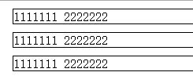

## 定位机制
-----------

### 普通流
	元素在 HTML 中顺序的正常文档流。

#### - 关于块级元素和行内元素

指定框类型 display: block | inline | inline-block | none;    
显式指定行内框的 width/height 没有作用，它的宽/高度总是刚好好容纳其内容，其值永远是 auto*auto。    
但是，行框的行高可以通过设置 line-height 来改变。

#### - 相对定位

**定位位置：**    
	相对于其在文档流中的开始位置。

**原理：**    
	```
	<!-- html -->
	<div>
		<span>1111111</span>
		<span>2222222</span>
	</div>
	 <div id="test">
		<span>1111111</span>
		<span>2222222</span>
	</div>
	 <div>
		<span>1111111</span>
		<span>2222222</span>
	</div>
	<!-- style -->
	div {
		border: 1px solid #000;
		margin: 10px;
	}
	#test {
		position: relative;
		top: -10px;
		left: -10px;
	}
	```
	这里啦，每个 div 相对于上一个 div 定位。

没有 #test 下效果：    
	
	这是默认情况下，position 以 static 为值，出现在普通流中，它会忽略 top, bottom, left, right 或者 z-index 声明。

相对定位下的效果：    
	


在使用相对定位时，无论是否移动（top/left..），元素仍然会占据原来的空间。因此，移动元素会覆盖其他框；移动后，后面流里的元素也不会随之移动。

### 绝对定位
	相对定位可以看做是普通流模型的一部分，因为其元素位置是相对于它在普通流中的位置的。
	然而，绝对定位的元素位置是与文档流无关的，且不占空间（就像在普通流元素的布局中不存在似的）。

**定位位置：**    
	相对于距离它最近的已定位的祖先元素；如果不存在已定位的祖先元素，那就相对于初始包含块。

**原理：**    
	这里是页脚自适应文档最底部的栗子~~
	```
	<!-- html -->
	<body>
		<div id="header"></div>
		<div id="wrapper"></div>
		<div id="footer"></div>
	</body>
	<!-- style -->
	html {
		min-height: 100%;
		position: relative;
	}
	body {
		min-height: 100%;
		padding-bottom: 180px;
		margin: 0;
		padding: 0;
	}
	#header {
		width: 100%;
		height: 56px;
		background-color: #444;
	}
	#wrapper {
		width: 100%;
		min-height: 700px;
	}
	#footer {
		width: 100%;
		height: 180px;
		position: absolute;
		bottom: 0;
		background-color: #444;
	}
	```
	这里啦，页脚 #footer 的绝对定位相对于 html 元素，始终在文档底部。

- 固定定位
	固定定位也是绝对定位的一种。

	**定位位置：**    
	相对于浏览器窗口。

	**原理：**    
	```
	<!-- html -->
	<body>
		<div id="aside-nav"></div>
	</body>
	<!-- style -->
	 #aside-nav {
		width: 46px;
		min-height: 100%;
		position: fixed;
		right: 0;
		background-color: #444;
	}
	```
	这里啦，不管页面怎么滚动、伸缩，它不哭不闹的 都在那里。

### 浮动
	浮动元素位置也是与文档流无关的，且不占空间（就像在普通流元素的布局中不存在似的）。

**定位位置：**    
	通过设置 `float: left | right;` 在其包含块中向左或向右浮动。
	直到它的外边缘碰到包含块或另一个浮动框的边缘，停止左右浮动。
	就好像水池里的泡沫，在碰到水池边或另一个停止浮动的泡沫，它就不能移动了。

**原理：**

- 怎么浮动？
	[参考W3C的浮动讲解](http://www.w3school.com.cn/css/css_positioning_floating.asp)

- 浮动的清理
	一是添加一个空元素标签 `<br style="clear:both;">` ，不过这浪费了一个标签。     
	二是使用haslayout(IE)、overflow(非IE)，`zoom: 1; overflow: hidden | scroll;`，不过这可能会切断元素或出现滚动条。    
	三是目前广泛使用的方法——通过伪元素清除，`.myDiv:after { content:" "; height:0; visibility:hidden; display:block; clear:both; }`。
	四是通过JavaScript清除。

	[参考张鑫旭博客第八、九大点](http://www.zhangxinxu.com/wordpress/2010/01/css-float%E6%B5%AE%E5%8A%A8%E7%9A%84%E6%B7%B1%E5%85%A5%E7%A0%94%E7%A9%B6%E3%80%81%E8%AF%A6%E8%A7%A3%E5%8F%8A%E6%8B%93%E5%B1%95%E4%BA%8C/)

### 扩展阅读
------------

[BFC特性下多栏自适应布局](http://www.zhangxinxu.com/wordpress/2015/02/css-deep-understand-flow-bfc-column-two-auto-layout/)