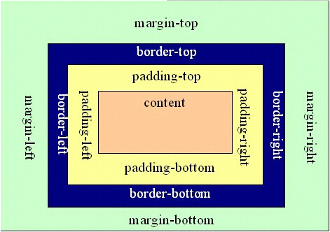
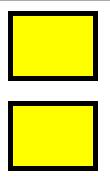
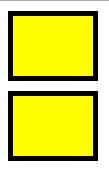

## 盒模型
---------

块级元素的盒子模型：



- 内容content：width / height
- 内边距：padding
- 边框：border
- 外边距：margin

```
#myBox {
	width: 70px;
	height: 50px;
	padding: 5px;
	border: 5px solid #000;
	margin: 10px;
}
```

在 `<div id="myBox"></div>` 中应用上述样式得到的就是盒子模型最后的总宽度是 110px 。同样，总高度是 90px 。

在IE6之前的盒模型计算有所不同，不再述了。


这里看到，在定义了 width / height 后得到的盒子模型的总宽高并不是我们写的值（它只是content的值）。所以，在布局需要计算的时候，就显得麻烦了。

要让定义的 width / height 值为最后的盒子的宽高？使用 CSS3 `box-sizing: border-box;`

`box-sizing: content-box | border-box | inherite;`

`box-sizing: content-box;` 就是上面盒子模型的默认方法，即宽度和高度分别应用到元素的内容框（content）

`box-sizing: border-box;` 则是IE6之前使用的方式，即为元素设定的宽度和高度决定了元素的边框盒（包括content/padding/border）


### 关于外边距叠加
-------------------

浏览器对块框的外边距是默认叠加了的，比如 `<p>` 元素上。

模拟看一下效果：
```
#myBox1 {
	width: 70px;
	height: 50px;
	padding: 5px;
	border: 5px solid #000;
	margin: 10px;
	background: #ff0;
}
#myBox2 {
	width: 70px;
	height: 50px;
	padding: 5px;
	border: 5px solid #000;
	margin: 10px;  /* margin: 20px 10px; 模拟效果 */
	background: #ff0;
}
```

如果没有叠加，效果会是这样：



发生了叠加，效果就是这样：



`#myBox2` 的 margin-top 与 `#myBox1` 的 margin-bottom 叠加在一起了。

- 发生的条件：    
普通文档流中块框的垂直外边距会发生叠加。其余情况，行内框、浮动框或绝对定位框之间的外边距不会叠加。

- 怎么叠加：    
当两个垂直外边距相遇时，形成的外边距的高度等于两个叠加外边距高度中的较大者。

- 哪些会叠加：    
	1. 两个相邻的块框之间可以叠加
	2. 子元素的顶外边距和父元素的顶外边距可以叠加
	3. 一个空块框本身也可以叠加（即自身的 margin-top 和 margin-bottom 相遇）
	4. 组合叠加（即上面3种的组合情况）
